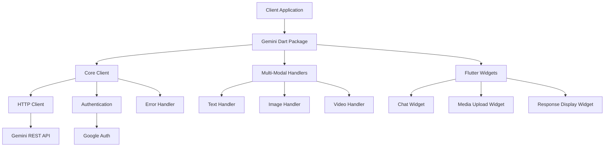
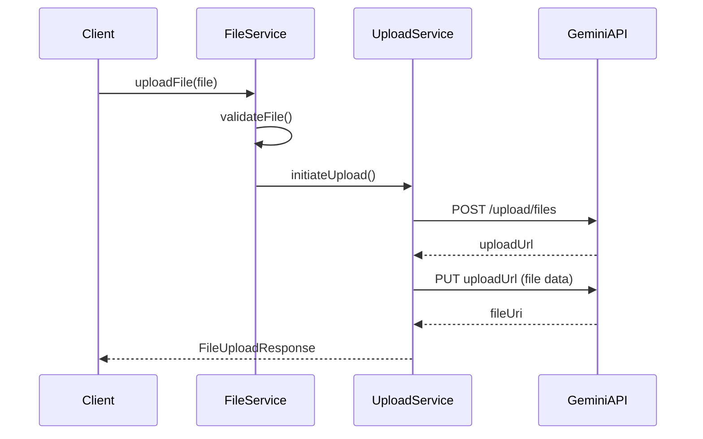

# Design Document

## Overview

The Gemini Dart Package is a comprehensive SDK that provides seamless integration with Google's Gemini AI models for both Dart and Flutter applications. The package follows a modular architecture with clear separation of concerns, enabling developers to easily incorporate multi-modal AI capabilities including text, image, and video processing.

The design emphasizes simplicity, performance, and flexibility while maintaining strong type safety and following Dart/Flutter best practices. The package will be published on pub.dev and support all major platforms (iOS, Android, Web, Desktop).

## Architecture

### High-Level Architecture



### Package Structure

```
lib/
├── src/
│   ├── core/
│   │   ├── client.dart              # Main Gemini client
│   │   ├── config.dart              # Configuration classes
│   │   ├── auth.dart                # Authentication handling
│   │   └── exceptions.dart          # Custom exceptions
│   ├── models/
│   │   ├── request.dart             # Request models
│   │   ├── response.dart            # Response models
│   │   ├── content.dart             # Content type models
│   │   └── generation_config.dart   # Generation configuration
│   ├── handlers/
│   │   ├── text_handler.dart        # Text processing
│   │   ├── image_handler.dart       # Image processing
│   │   ├── video_handler.dart       # Video processing
│   │   └── multimodal_handler.dart  # Combined content handling
│   ├── services/
│   │   ├── http_service.dart        # HTTP communication
│   │   ├── file_service.dart        # File operations
│   │   ├── cache_service.dart       # Response caching
│   │   └── upload_service.dart      # Large file uploads
│   ├── utils/
│   │   ├── validators.dart          # Input validation
│   │   ├── converters.dart          # Data conversion utilities
│   │   └── constants.dart           # Package constants
│   └── widgets/                     # Flutter-specific widgets
│       ├── gemini_chat.dart         # Chat interface widget
│       ├── media_picker.dart        # Media selection widget
│       ├── response_viewer.dart     # Response display widget
│       └── loading_indicator.dart   # Custom loading states
├── gemini_dart.dart                 # Main export file
└── flutter_gemini.dart              # Flutter-specific exports
```

## Components and Interfaces

### Core Client Interface

```dart
abstract class GeminiClient {
  /// Initialize the client with API key and configuration
  Future<void> initialize(String apiKey, {GeminiConfig? config});

  /// Generate content from text prompt
  Future<GeminiResponse> generateContent(String prompt, {GenerationConfig? config});

  /// Generate content from multi-modal input
  Future<GeminiResponse> generateFromContent(List<Content> contents, {GenerationConfig? config});

  /// Stream content generation for real-time responses
  Stream<GeminiResponse> generateContentStream(String prompt, {GenerationConfig? config});

  /// Upload and process large files (videos)
  Future<FileUploadResponse> uploadFile(File file, {String? mimeType});

  /// Get available models
  Future<List<GeminiModel>> getModels();

  /// Dispose resources
  void dispose();
}
```

### Content Models

```dart
abstract class Content {
  String get type;
  Map<String, dynamic> toJson();
}

class TextContent extends Content {
  final String text;
  TextContent(this.text);
}

class ImageContent extends Content {
  final Uint8List data;
  final String mimeType;
  ImageContent(this.data, this.mimeType);
}

class VideoContent extends Content {
  final String fileUri; // For uploaded files
  final String mimeType;
  VideoContent(this.fileUri, this.mimeType);
}
```

### Response Models

```dart
class GeminiResponse {
  final String? text;
  final List<Candidate> candidates;
  final PromptFeedback? promptFeedback;
  final UsageMetadata? usageMetadata;

  GeminiResponse({
    this.text,
    required this.candidates,
    this.promptFeedback,
    this.usageMetadata,
  });
}

class Candidate {
  final Content content;
  final String? finishReason;
  final int index;
  final List<SafetyRating> safetyRatings;

  Candidate({
    required this.content,
    this.finishReason,
    required this.index,
    required this.safetyRatings,
  });
}
```

### Configuration Classes

```dart
class GeminiConfig {
  final String baseUrl;
  final Duration timeout;
  final int maxRetries;
  final bool enableLogging;
  final CacheConfig? cacheConfig;

  const GeminiConfig({
    this.baseUrl = 'https://generativelanguage.googleapis.com',
    this.timeout = const Duration(seconds: 30),
    this.maxRetries = 3,
    this.enableLogging = false,
    this.cacheConfig,
  });
}

class GenerationConfig {
  final double? temperature;
  final int? maxOutputTokens;
  final double? topP;
  final int? topK;
  final List<String>? stopSequences;
  final String? responseMimeType;

  const GenerationConfig({
    this.temperature,
    this.maxOutputTokens,
    this.topP,
    this.topK,
    this.stopSequences,
    this.responseMimeType,
  });
}
```

## Data Models

### Request Flow

1. **Input Processing**: Content is validated and converted to appropriate format
2. **Authentication**: API key is attached to requests with proper headers
3. **Request Building**: JSON payload is constructed according to Gemini API specification
4. **HTTP Communication**: Requests are sent with retry logic and error handling
5. **Response Processing**: JSON responses are parsed into strongly-typed models
6. **Caching**: Responses can be cached based on configuration

### File Upload Flow



### Multi-Modal Content Handling

The package supports combining different content types in a single request:

```dart
final contents = [
  TextContent("Analyze this image and video:"),
  ImageContent(imageBytes, "image/jpeg"),
  VideoContent(videoFileUri, "video/mp4"),
  TextContent("What are the key differences?"),
];

final response = await client.generateFromContent(contents);
```

## Error Handling

### Exception Hierarchy

```dart
abstract class GeminiException implements Exception {
  final String message;
  final String? code;
  final dynamic originalError;

  const GeminiException(this.message, {this.code, this.originalError});
}

class GeminiAuthException extends GeminiException {
  const GeminiAuthException(String message, {String? code})
    : super(message, code: code);
}

class GeminiRateLimitException extends GeminiException {
  final Duration retryAfter;
  const GeminiRateLimitException(String message, this.retryAfter)
    : super(message);
}

class GeminiValidationException extends GeminiException {
  final Map<String, String> fieldErrors;
  const GeminiValidationException(String message, this.fieldErrors)
    : super(message);
}
```

### Retry Strategy

```dart
class RetryConfig {
  final int maxAttempts;
  final Duration initialDelay;
  final double backoffMultiplier;
  final Duration maxDelay;
  final List<Type> retryableExceptions;

  const RetryConfig({
    this.maxAttempts = 3,
    this.initialDelay = const Duration(seconds: 1),
    this.backoffMultiplier = 2.0,
    this.maxDelay = const Duration(seconds: 30),
    this.retryableExceptions = const [
      SocketException,
      TimeoutException,
      GeminiRateLimitException,
    ],
  });
}
```

## Testing Strategy

### Unit Testing

- **Model Tests**: Verify JSON serialization/deserialization
- **Validation Tests**: Test input validation logic
- **Handler Tests**: Mock API responses and test processing logic
- **Configuration Tests**: Verify configuration parsing and defaults

### Integration Testing

- **API Integration**: Test actual API calls with test credentials
- **File Upload**: Test large file upload functionality
- **Multi-modal**: Test combined content type requests
- **Error Scenarios**: Test various error conditions and recovery

### Widget Testing (Flutter)

- **Widget Rendering**: Test Flutter widgets render correctly
- **User Interactions**: Test tap, scroll, and input interactions
- **State Management**: Test widget state changes and updates
- **Platform Testing**: Test on different platforms (iOS, Android, Web)

### Performance Testing

- **Memory Usage**: Monitor memory consumption with large files
- **Response Times**: Measure API response times and caching effectiveness
- **Concurrent Requests**: Test multiple simultaneous requests
- **File Size Limits**: Test behavior with various file sizes

### Test Structure

```
test/
├── unit/
│   ├── models/
│   ├── handlers/
│   ├── services/
│   └── utils/
├── integration/
│   ├── api_test.dart
│   ├── multimodal_test.dart
│   └── upload_test.dart
├── widget/
│   ├── gemini_chat_test.dart
│   ├── media_picker_test.dart
│   └── response_viewer_test.dart
└── performance/
    ├── memory_test.dart
    ├── concurrent_test.dart
    └── file_size_test.dart
```

### Mocking Strategy

- Use `mockito` for HTTP client mocking
- Create test fixtures for API responses
- Mock file system operations for testing
- Use `flutter_test` for widget testing

This design provides a solid foundation for building a comprehensive, performant, and user-friendly Gemini Dart package that meets all the specified requirements while following Dart and Flutter best practices.
